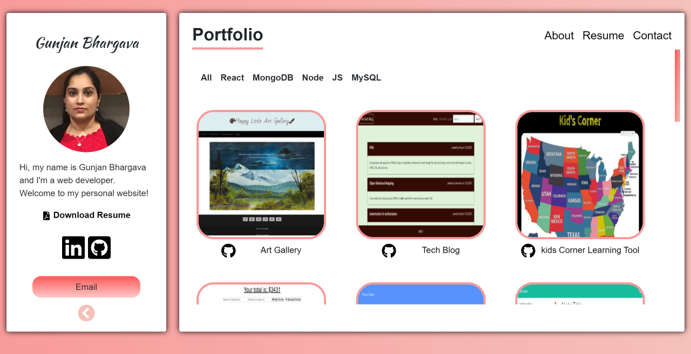
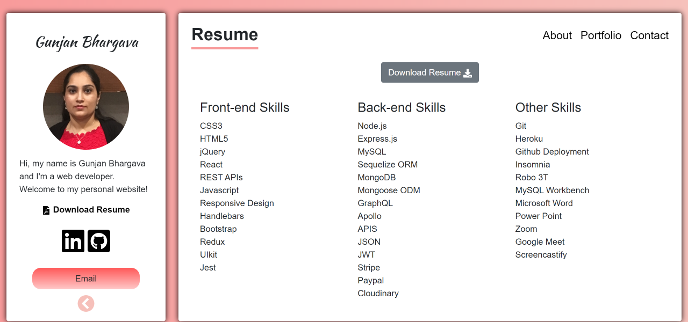

# React Portfolio

## Description

This is my simple, responsive professional portfolio demonstrating my core skills in Web develpoment. Build with React, Bootstrap, Framer motion and differnt react packages.
Visit my online portfolio where you can read about me, can see my recent projects, resume and contact me through different means.

## Key Learning:

- React.js
- react-router-dom
- framer motion

## Table of Contents

- [Installation](#Installation)
- [Usage](#Usage)
- [License](#License)
- [Contributors](#Contributors)
- [Tests](#Tests)
- [Technologies](#Technologies)
- [Questions](#Questions)

## Installation

- Clone project into a local directory and cd into that directory.
- On console run npm install to load dependencies for running app.
- Run the command npm start to open site in local development server on port 3000.
- Navigate to port 3000 of your localhost to use application locally.

## Usage

- Portfolio Section

  

- Resume Section (Below is a quick overview of my main technical skill sets and technologies I use.)

  

- Deployed Link Github

  [View my Portfolio](https://gunjanb.github.io/React-Portfolio)

## License

- The application is covered under the license MIT. For more Info please visit [License Info](https://opensource.org/licenses/MIT)

## Contributors

- None

## Tests

- None

## Technologies

- `React.js`
- `Framer motion`
- `React-Bootsrap`
- `React-icons`
- `CSS`
- `HTML`

## Questions

If you have any questions about project you can either contact me or visit my github profile.

Link to my Github: [Github](https://github.com/gunjanb)

Email address :[gunjanbhargava2021@gmail.com](mailto:gunjanbhargava2021@gmail.com)
